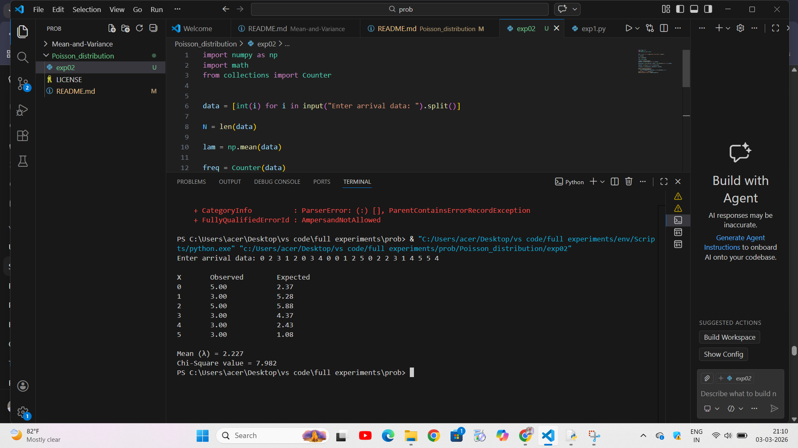

# Fitting Poisson  distribution
# DATE:03.03.2026
# Aim : 

To fit poisson distribution for the arrival of objects per minute from the feeder

# Software required :  

Python and Visual component tool

# Theory:

The Poisson distribution is the discrete probability distribution of the number of events occurring in a given time period, given the average number of times the event occurs over that time period.


 Conditions for Poisson Distribution:

1. An event can occur any number of times during a time period.
2. Events occur independently. I
3. The rate of occurrence is constant.
4. The probability of an event occurring is proportional to the length of the time period. 
 
# Procedure :


# Experiment :


# Program :
```
import numpy as np
import math
from collections import Counter


data = [int(i) for i in input("Enter arrival data: ").split()]

N = len(data)

lam = np.mean(data)

freq = Counter(data)

x_values = sorted(freq.keys())
observed = np.array([freq[x] for x in x_values])

poisson_prob = [(math.exp(-lam) * lam**x) / math.factorial(x) for x in x_values]

expected = np.array([p * N for p in poisson_prob])

chi_square = np.sum((observed - expected)**2 / expected)

print("\nX\tObserved\tExpected")
for i in range(len(x_values)):
    print(f"{x_values[i]}\t{observed[i]:.2f}\t\t{expected[i]:.2f}")

print("\nMean (λ) =", round(lam,3))
print("Chi-Square value =", round(chi_square,3))
```
 

# Output : 



# Results

The Poisson distribution is fitted for the objects arrived from feeder per minute and the data is tested using Chi-square test. 
 
